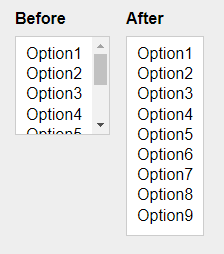

# multiselectAutosize.js

*Version 1.0*

Make select multiple elements autosize vertically to fit the options.



## Setup

### HTML

A long select box to make sure the select box autosize to fill the options.

```html
<select multiple>
  <option>Option1</option>
  <option>Option2</option>
  <option>Option3</option>
  <option>Option4</option>
  <option>Option5</option>
  <option>Option6</option>
  <option>Option7</option>
  <option>Option8</option>
  <option>Option9</option>
</select>
```

### Javascript

```html
<script src="assets/js/multiselectAutosize.min.js"></script>
<script>
multiselectAutosize.init();
</script>
```

## Options

### selector

```js
multiselectAutosize.init({
  selector: 'select[multiple]'
});
```

## Methods

### Destroy

If you want to reset the select to the default state, you can use the `destroy` method.

```js
let elements = document.querySelectorAll('select[multiple]');
multiselectAutosize.destroy(elements);
```

## CSS

You can rely on your own CSS. Because you no longer need the scrollbar, here is a quick tip to remove it.

```css
select[multiple]::-webkit-scrollbar { 
  display: none; 
}
```

## Donate

Donate to [DevoneraAB](https://www.paypal.me/DevoneraAB) if you want.

## License

MIT